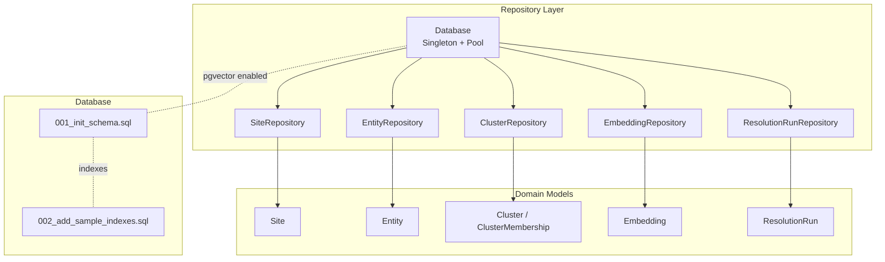
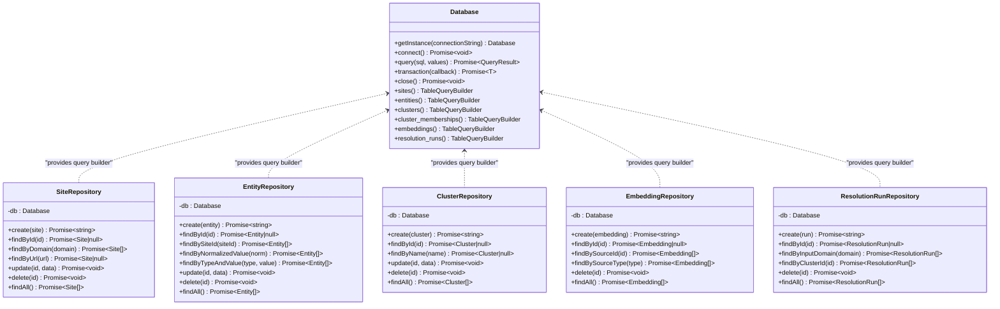
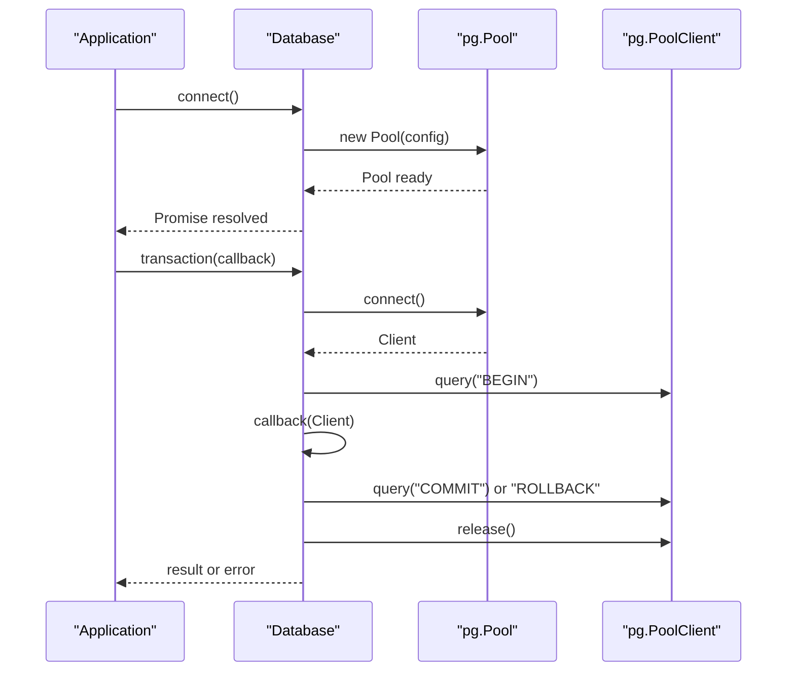
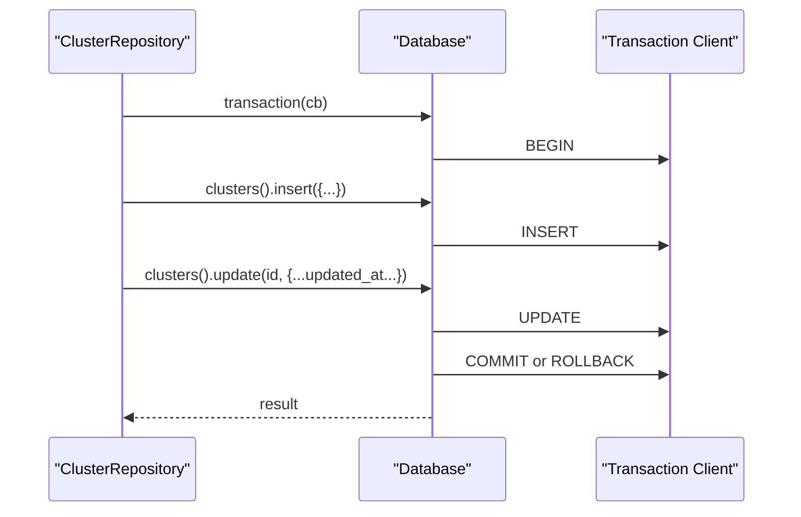
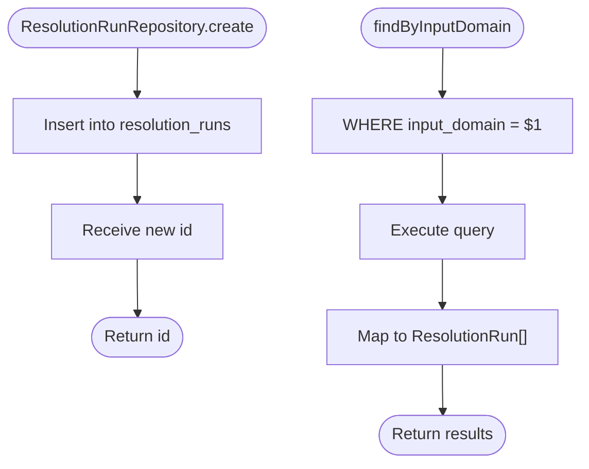
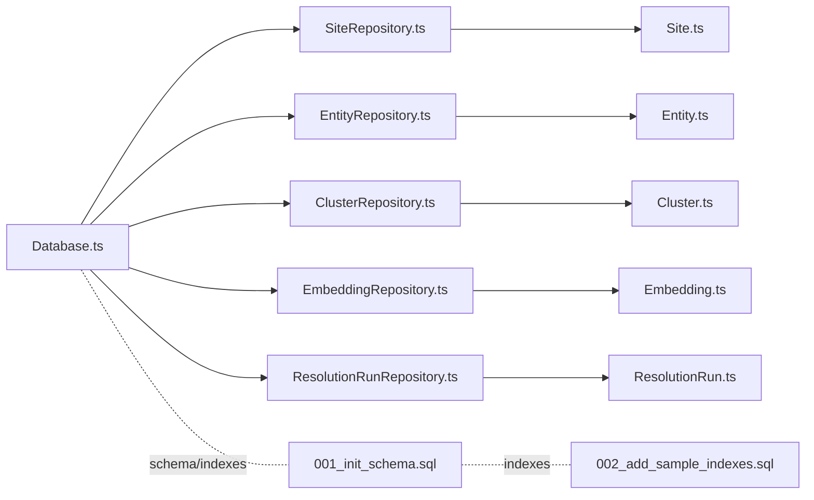

# Repository Layer

<cite>
**Referenced Files in This Document**
- [Database.ts](file://src/repository/Database.ts)
- [SiteRepository.ts](file://src/repository/SiteRepository.ts)
- [EntityRepository.ts](file://src/repository/EntityRepository.ts)
- [ClusterRepository.ts](file://src/repository/ClusterRepository.ts)
- [EmbeddingRepository.ts](file://src/repository/EmbeddingRepository.ts)
- [ResolutionRunRepository.ts](file://src/repository/ResolutionRunRepository.ts)
- [index.ts](file://src/repository/index.ts)
- [Site.ts](file://src/domain/models/Site.ts)
- [Entity.ts](file://src/domain/models/Entity.ts)
- [Cluster.ts](file://src/domain/models/Cluster.ts)
- [Embedding.ts](file://src/domain/models/Embedding.ts)
- [ResolutionRun.ts](file://src/domain/models/ResolutionRun.ts)
- [001_init_schema.sql](file://db/migrations/001_init_schema.sql)
- [002_add_sample_indexes.sql](file://db/migrations/002_add_sample_indexes.sql)
- [SimilarityScorer.ts](file://src/service/SimilarityScorer.ts)
</cite>

## Table of Contents
1. [Introduction](#introduction)
2. [Project Structure](#project-structure)
3. [Core Components](#core-components)
4. [Architecture Overview](#architecture-overview)
5. [Detailed Component Analysis](#detailed-component-analysis)
6. [Dependency Analysis](#dependency-analysis)
7. [Performance Considerations](#performance-considerations)
8. [Troubleshooting Guide](#troubleshooting-guide)
9. [Conclusion](#conclusion)
10. [Appendices](#appendices)

## Introduction
This document describes the repository layer for ARES, focusing on database interaction patterns and query building. It covers the Database singleton that manages PostgreSQL connections with pgvector extension support, typed query builders for each repository, and the domain models they operate on. It also documents SiteRepository for storefront CRUD and search/filtering, EntityRepository for contact information with normalization and deduplication logic, ClusterRepository for operator group operations, EmbeddingRepository for vector similarity searches, and ResolutionRunRepository for audit trail operations. Transaction management, error handling, and performance optimization techniques are included, along with examples of complex queries and integration patterns with the service layer.

## Project Structure
The repository layer is organized around a central Database singleton that exposes typed query builders for each table. Each repository encapsulates CRUD operations and mapping to domain models. The domain models define the shape and invariants of persisted data. Database migrations define schema and indexes, including pgvector support.

**Diagram sources**
- [Database.ts:28-315](file://src/repository/Database.ts#L28-L315)
- [SiteRepository.ts:10-98](file://src/repository/SiteRepository.ts#L10-L98)
- [EntityRepository.ts:10-103](file://src/repository/EntityRepository.ts#L10-L103)
- [ClusterRepository.ts:10-92](file://src/repository/ClusterRepository.ts#L10-L92)
- [EmbeddingRepository.ts:10-106](file://src/repository/EmbeddingRepository.ts#L10-L106)
- [ResolutionRunRepository.ts:10-97](file://src/repository/ResolutionRunRepository.ts#L10-L97)
- [Site.ts:7-56](file://src/domain/models/Site.ts#L7-L56)
- [Entity.ts:12-73](file://src/domain/models/Entity.ts#L12-L73)
- [Cluster.ts:7-141](file://src/domain/models/Cluster.ts#L7-L141)
- [Embedding.ts:16-78](file://src/domain/models/Embedding.ts#L16-L78)
- [ResolutionRun.ts:17-98](file://src/domain/models/ResolutionRun.ts#L17-L98)
- [001_init_schema.sql:1-180](file://db/migrations/001_init_schema.sql#L1-L180)
- [002_add_sample_indexes.sql:1-72](file://db/migrations/002_add_sample_indexes.sql#L1-L72)

**Section sources**
- [Database.ts:28-315](file://src/repository/Database.ts#L28-L315)
- [index.ts:1-10](file://src/repository/index.ts#L1-L10)
- [001_init_schema.sql:1-180](file://db/migrations/001_init_schema.sql#L1-L180)
- [002_add_sample_indexes.sql:1-72](file://db/migrations/002_add_sample_indexes.sql#L1-L72)

## Core Components
- Database singleton with connection pooling and retry logic for transient PostgreSQL errors.
- Typed query builders per table returning strongly-typed records and supporting insert/find/update/delete.
- Repository classes wrapping query builders with domain model mapping and business-specific operations.
- Domain models enforcing invariants and providing serialization helpers.

Key responsibilities:
- Database: connection lifecycle, transactions, raw SQL execution with retries, and table-specific query builders.
- Repositories: CRUD, filtering, and mapping to/from domain models.
- Domain models: data validation, derived properties, and safe serialization.

**Section sources**
- [Database.ts:28-155](file://src/repository/Database.ts#L28-L155)
- [Database.ts:156-306](file://src/repository/Database.ts#L156-L306)
- [SiteRepository.ts:10-98](file://src/repository/SiteRepository.ts#L10-L98)
- [EntityRepository.ts:10-103](file://src/repository/EntityRepository.ts#L10-L103)
- [ClusterRepository.ts:10-92](file://src/repository/ClusterRepository.ts#L10-L92)
- [EmbeddingRepository.ts:10-106](file://src/repository/EmbeddingRepository.ts#L10-L106)
- [ResolutionRunRepository.ts:10-97](file://src/repository/ResolutionRunRepository.ts#L10-L97)
- [Site.ts:7-56](file://src/domain/models/Site.ts#L7-L56)
- [Entity.ts:12-73](file://src/domain/models/Entity.ts#L12-L73)
- [Cluster.ts:7-141](file://src/domain/models/Cluster.ts#L7-L141)
- [Embedding.ts:16-78](file://src/domain/models/Embedding.ts#L16-L78)
- [ResolutionRun.ts:17-98](file://src/domain/models/ResolutionRun.ts#L17-L98)

## Architecture Overview
The repository layer follows a clean architecture pattern:
- Database singleton centralizes connectivity and pooling.
- Each repository encapsulates persistence logic for a domain entity.
- Domain models isolate business rules and ensure data integrity.
- Migrations define schema and indexes, including pgvector support.

**Diagram sources**
- [Database.ts:28-315](file://src/repository/Database.ts#L28-L315)
- [SiteRepository.ts:10-98](file://src/repository/SiteRepository.ts#L10-L98)
- [EntityRepository.ts:10-103](file://src/repository/EntityRepository.ts#L10-L103)
- [ClusterRepository.ts:10-92](file://src/repository/ClusterRepository.ts#L10-L92)
- [EmbeddingRepository.ts:10-106](file://src/repository/EmbeddingRepository.ts#L10-L106)
- [ResolutionRunRepository.ts:10-97](file://src/repository/ResolutionRunRepository.ts#L10-L97)

## Detailed Component Analysis

### Database Singleton
The Database singleton manages:
- Connection pooling with configurable limits and timeouts.
- Retry logic for transient PostgreSQL errors during query execution.
- Transactions via BEGIN/COMMIT/ROLLBACK with automatic client release.
- Typed query builders per table with insert/findById/findAll/update/delete.
- Utility methods to close the pool and expose the underlying Pool.

**Diagram sources**
- [Database.ts:56-148](file://src/repository/Database.ts#L56-L148)
- [Database.ts:120-137](file://src/repository/Database.ts#L120-L137)

Implementation highlights:
- Connection pooling with idle and connection timeouts.
- Retry loop for transient network/database errors.
- Transaction wrapper ensures ACID semantics and resource cleanup.
- Table-specific query builders generated via a generic factory.

**Section sources**
- [Database.ts:28-155](file://src/repository/Database.ts#L28-L155)
- [Database.ts:156-306](file://src/repository/Database.ts#L156-L306)

### SiteRepository
CRUD operations for storefront data with search and filtering:
- Create: inserts a new site with computed first_seen_at.
- Read: findById, findByDomain, findByUrl, findAll.
- Update/Delete: standard operations.
- Mapping: converts database records to Site domain model.

**Diagram sources**
- [SiteRepository.ts:20-41](file://src/repository/SiteRepository.ts#L20-L41)
- [SiteRepository.ts:76-94](file://src/repository/SiteRepository.ts#L76-L94)

Operational notes:
- findByDomain returns all matches; findByUrl returns the first match.
- Mapping preserves immutability and date handling.

**Section sources**
- [SiteRepository.ts:10-98](file://src/repository/SiteRepository.ts#L10-L98)
- [Site.ts:7-56](file://src/domain/models/Site.ts#L7-L56)

### EntityRepository
Manages contact information with normalization and deduplication logic:
- Create: inserts entity with optional normalized_value.
- Read: findById, findBySiteId, findByNormalizedValue, findByTypeAndValue, findAll.
- Update/Delete: standard operations.
- Deduplication: unique constraint on (site_id, type, value) prevents duplicates.

**Diagram sources**
- [EntityRepository.ts:20-54](file://src/repository/EntityRepository.ts#L20-L54)
- [EntityRepository.ts:78-99](file://src/repository/EntityRepository.ts#L78-L99)
- [002_add_sample_indexes.sql:52-54](file://db/migrations/002_add_sample_indexes.sql#L52-L54)

Normalization and deduplication:
- Normalized values enable cross-site matching.
- Unique index on (site_id, type, value) enforces uniqueness.

**Section sources**
- [EntityRepository.ts:10-103](file://src/repository/EntityRepository.ts#L10-L103)
- [Entity.ts:12-73](file://src/domain/models/Entity.ts#L12-L73)
- [001_init_schema.sql:37-58](file://db/migrations/001_init_schema.sql#L37-L58)
- [002_add_sample_indexes.sql:52-54](file://db/migrations/002_add_sample_indexes.sql#L52-L54)

### ClusterRepository
Operator group operations including membership management and confidence aggregation:
- Create: inserts cluster with created_at and updated_at timestamps.
- Read: findById, findByName, findAll.
- Update: updates cluster and sets updated_at.
- Delete: standard operation.
- Confidence aggregation: performed at higher layers (service) using membership data.

**Diagram sources**
- [ClusterRepository.ts:20-52](file://src/repository/ClusterRepository.ts#L20-L52)
- [Database.ts:120-137](file://src/repository/Database.ts#L120-L137)

Notes:
- Updated timestamp managed automatically on updates.
- Confidence validated in the domain model.

**Section sources**
- [ClusterRepository.ts:10-92](file://src/repository/ClusterRepository.ts#L10-L92)
- [Cluster.ts:7-141](file://src/domain/models/Cluster.ts#L7-L141)

### EmbeddingRepository
Vector similarity searches and pgvector integration:
- Create: stores embedding with vector converted to PostgreSQL array format.
- Read: findById, findBySourceId, findBySourceType, findAll.
- Vector parsing: handles string representation returned by DB.
- pgvector support: uses vector(1024) type; includes fallback comment in schema.

**Diagram sources**
- [EmbeddingRepository.ts:20-34](file://src/repository/EmbeddingRepository.ts#L20-L34)
- [EmbeddingRepository.ts:78-102](file://src/repository/EmbeddingRepository.ts#L78-L102)
- [Embedding.ts:16-78](file://src/domain/models/Embedding.ts#L16-L78)
- [001_init_schema.sql:114-131](file://db/migrations/001_init_schema.sql#L114-L131)

Notes:
- Vector dimension validated in domain model with warning for non-standard sizes.
- Service-side similarity scoring available for ranking candidates.

**Section sources**
- [EmbeddingRepository.ts:10-106](file://src/repository/EmbeddingRepository.ts#L10-L106)
- [Embedding.ts:16-78](file://src/domain/models/Embedding.ts#L16-L78)
- [001_init_schema.sql:114-131](file://db/migrations/001_init_schema.sql#L114-L131)
- [SimilarityScorer.ts:1-63](file://src/service/SimilarityScorer.ts#L1-L63)

### ResolutionRunRepository
Audit trail operations and historical tracking:
- Create: inserts resolution run with JSONB fields and execution metrics.
- Read: findById, findByInputDomain, findByClusterId, findAll.
- Mapping: normalizes arrays and dates for safe consumption.

**Diagram sources**
- [ResolutionRunRepository.ts:20-49](file://src/repository/ResolutionRunRepository.ts#L20-L49)
- [ResolutionRunRepository.ts:69-93](file://src/repository/ResolutionRunRepository.ts#L69-L93)

Notes:
- JSONB fields preserve structured input and matching signals.
- Execution metrics enable performance monitoring.

**Section sources**
- [ResolutionRunRepository.ts:10-97](file://src/repository/ResolutionRunRepository.ts#L10-L97)
- [ResolutionRun.ts:17-98](file://src/domain/models/ResolutionRun.ts#L17-L98)

## Dependency Analysis
Repositories depend on the Database singleton for connectivity and query execution. Domain models are consumed by repositories for mapping. Migrations define schema and indexes that influence query performance.

**Diagram sources**
- [Database.ts:28-315](file://src/repository/Database.ts#L28-L315)
- [SiteRepository.ts:10-98](file://src/repository/SiteRepository.ts#L10-L98)
- [EntityRepository.ts:10-103](file://src/repository/EntityRepository.ts#L10-L103)
- [ClusterRepository.ts:10-92](file://src/repository/ClusterRepository.ts#L10-L92)
- [EmbeddingRepository.ts:10-106](file://src/repository/EmbeddingRepository.ts#L10-L106)
- [ResolutionRunRepository.ts:10-97](file://src/repository/ResolutionRunRepository.ts#L10-L97)
- [Site.ts:7-56](file://src/domain/models/Site.ts#L7-L56)
- [Entity.ts:12-73](file://src/domain/models/Entity.ts#L12-L73)
- [Cluster.ts:7-141](file://src/domain/models/Cluster.ts#L7-L141)
- [Embedding.ts:16-78](file://src/domain/models/Embedding.ts#L16-L78)
- [ResolutionRun.ts:17-98](file://src/domain/models/ResolutionRun.ts#L17-L98)
- [001_init_schema.sql:1-180](file://db/migrations/001_init_schema.sql#L1-L180)
- [002_add_sample_indexes.sql:1-72](file://db/migrations/002_add_sample_indexes.sql#L1-L72)

**Section sources**
- [index.ts:1-10](file://src/repository/index.ts#L1-L10)
- [001_init_schema.sql:1-180](file://db/migrations/001_init_schema.sql#L1-L180)
- [002_add_sample_indexes.sql:1-72](file://db/migrations/002_add_sample_indexes.sql#L1-L72)

## Performance Considerations
- Connection pooling: configured with max size and timeouts; reuse clients via transactions.
- Retries: transient errors are retried with exponential backoff timing.
- Indexes: migrations define indexes for frequent filters (domain, normalized_value, source_type, etc.).
- Partial and composite indexes: optimize high-confidence clusters, recent runs, and membership lookups.
- Vector similarity: pgvector extension enables cosine similarity; consider enabling IVFFLAT index for large-scale similarity search.
- JSONB fields: efficient storage for structured logs and signals; ensure appropriate indexing for filtering.

[No sources needed since this section provides general guidance]

## Troubleshooting Guide
Common issues and strategies:
- Connection failures: verify connection string and network; Database.connect() performs a health check; retries occur for transient errors.
- Transaction conflicts: wrap multi-step writes in Database.transaction(); ensure rollback on errors.
- Vector conversion errors: EmbeddingRepository.create expects numeric vectors; ensure proper conversion to PostgreSQL array format.
- Missing pgvector: migrations enable pgvector; confirm extension availability and vector index creation.
- Duplicate entities: unique index on (site_id, type, value); handle constraint violations gracefully in service layer.
- Large result sets: use filtered queries and pagination; leverage indexes defined in migrations.

**Section sources**
- [Database.ts:56-115](file://src/repository/Database.ts#L56-L115)
- [Database.ts:120-137](file://src/repository/Database.ts#L120-L137)
- [EmbeddingRepository.ts:20-34](file://src/repository/EmbeddingRepository.ts#L20-L34)
- [001_init_schema.sql:5-7](file://db/migrations/001_init_schema.sql#L5-L7)
- [002_add_sample_indexes.sql:52-63](file://db/migrations/002_add_sample_indexes.sql#L52-L63)

## Conclusion
The repository layer provides a robust, typed abstraction over PostgreSQL with strong domain modeling and pgvector support. The Database singleton centralizes connectivity and transactions, while individual repositories encapsulate persistence logic and mapping. Migrations define a schema optimized for ARES’s core operations, including deduplication, clustering, embeddings, and audit trails. Together, these components enable scalable, maintainable data access patterns aligned with the service layer.

[No sources needed since this section summarizes without analyzing specific files]

## Appendices

### Example Workflows and Integrations
- Batch ingestion: use Database.transaction to insert multiple entities and embeddings atomically.
- Deduplication pipeline: query findByTypeAndValue with normalized_value; insert only if absent using unique constraints.
- Similarity search: compute query vector in service, fetch candidate embeddings by source_type, rank with SimilarityScorer, and persist top-k results.
- Audit trail: after resolution, create a ResolutionRun with input_entities and matching_signals for historical tracking.

[No sources needed since this section provides general guidance]