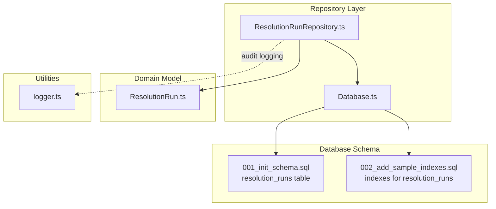
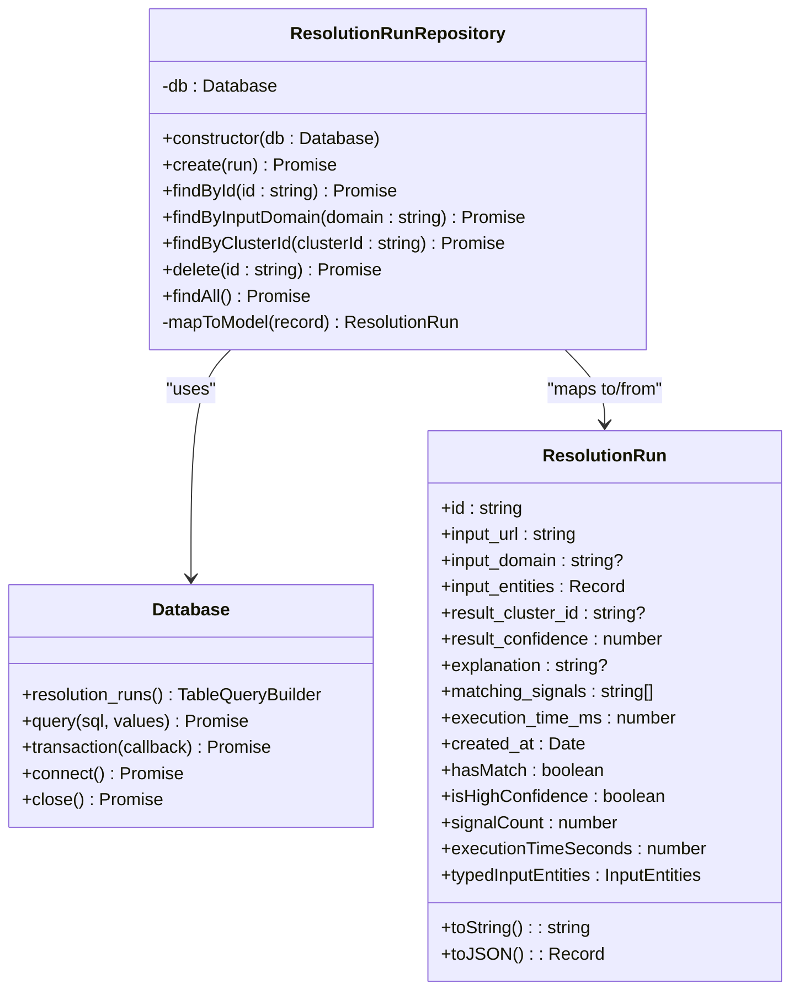
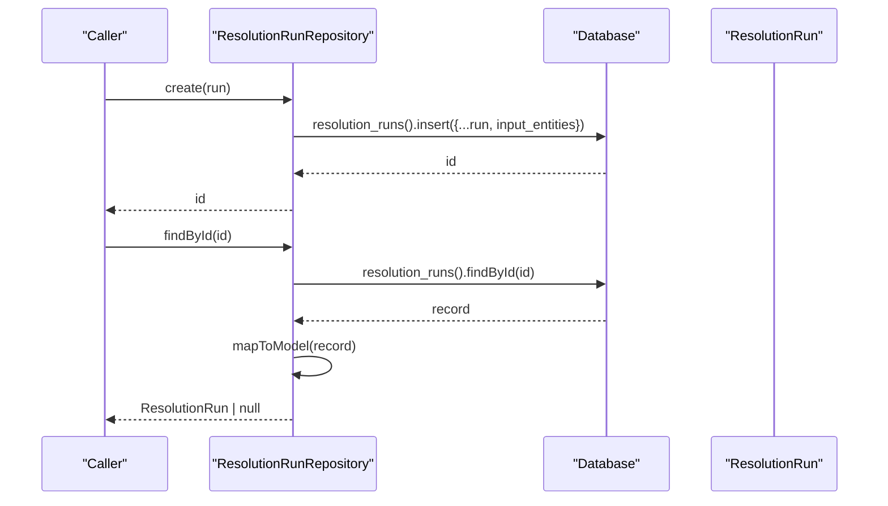
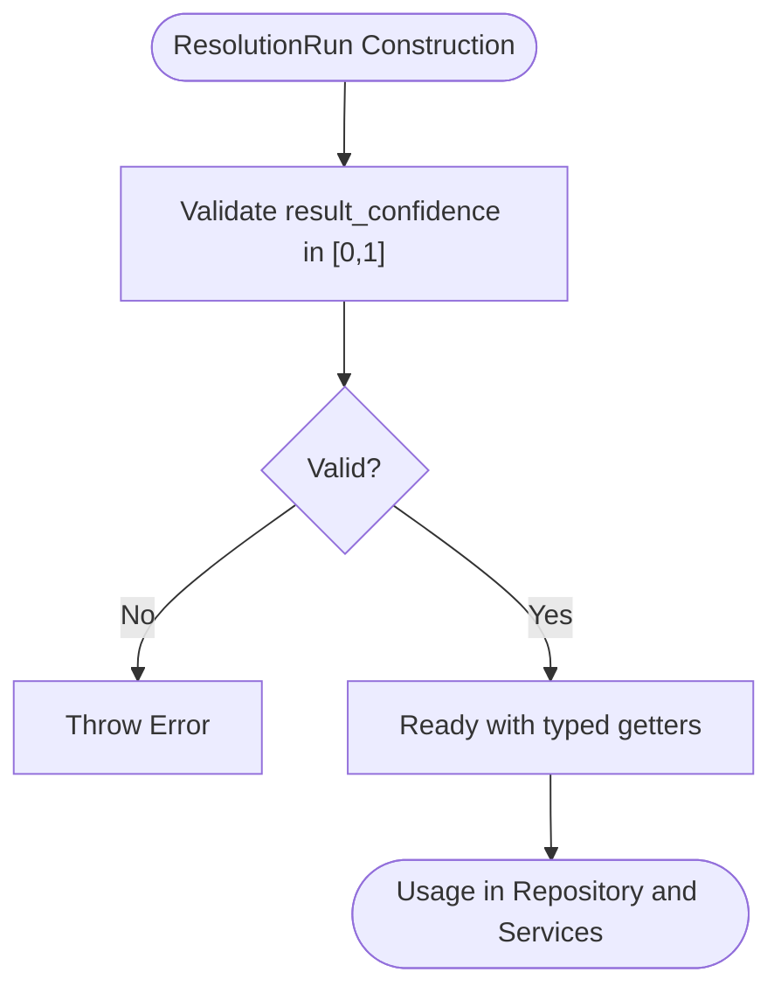
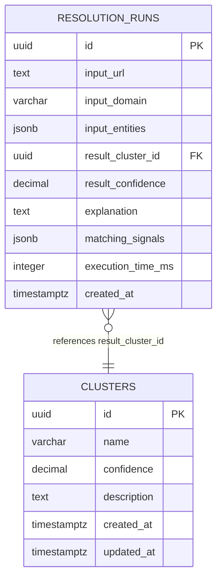
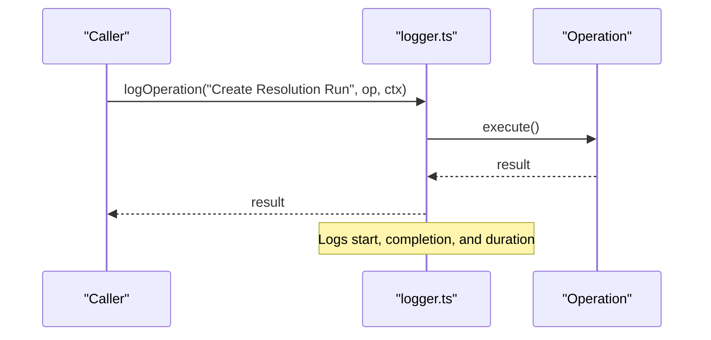
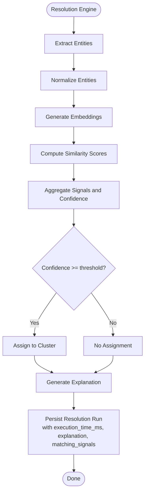
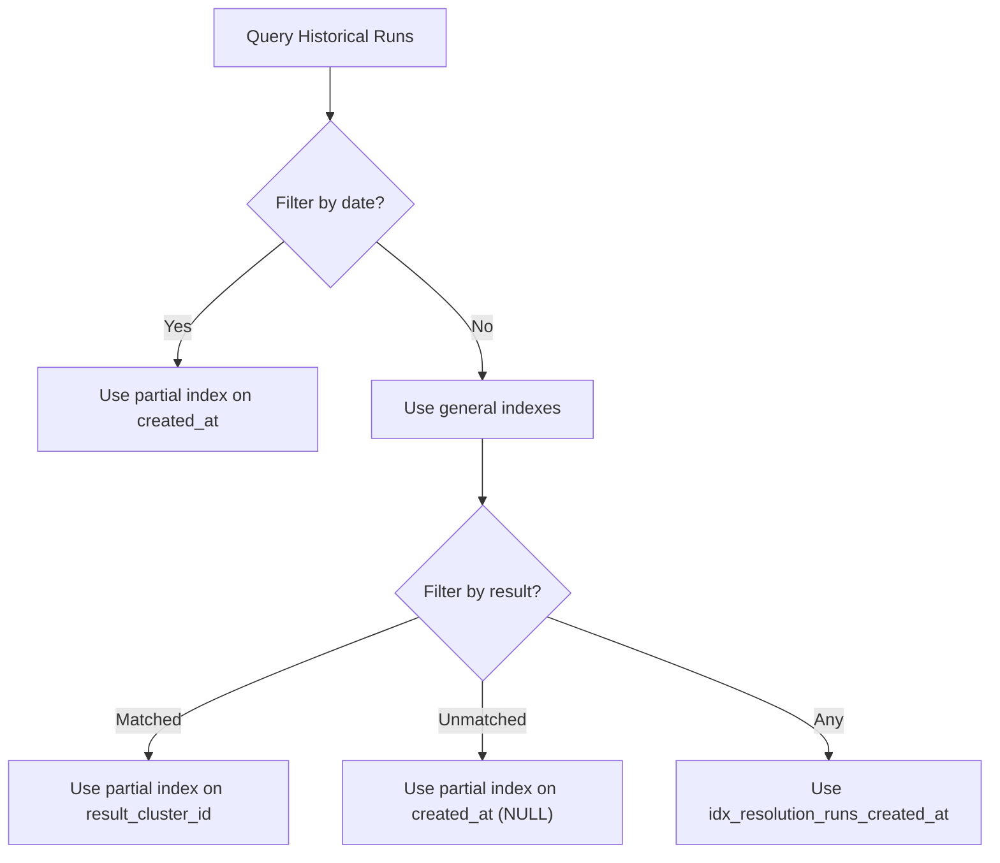
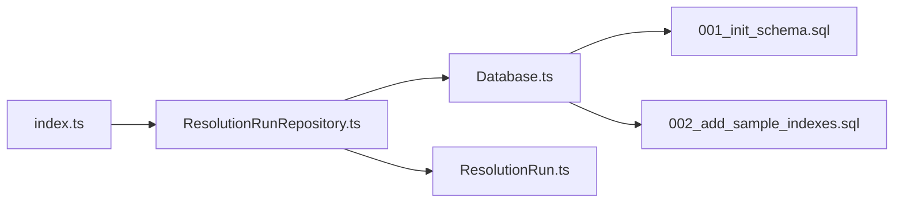

# Resolution Run Repository

<cite>
**Referenced Files in This Document**
- [ResolutionRunRepository.ts](file://src/repository/ResolutionRunRepository.ts)
- [ResolutionRun.ts](file://src/domain/models/ResolutionRun.ts)
- [Database.ts](file://src/repository/Database.ts)
- [001_init_schema.sql](file://db/migrations/001_init_schema.sql)
- [002_add_sample_indexes.sql](file://db/migrations/002_add_sample_indexes.sql)
- [logger.ts](file://src/util/logger.ts)
- [ResolutionEngine.ts](file://src/service/ResolutionEngine.ts)
- [index.ts](file://src/repository/index.ts)
</cite>

## Table of Contents
1. [Introduction](#introduction)
2. [Project Structure](#project-structure)
3. [Core Components](#core-components)
4. [Architecture Overview](#architecture-overview)
5. [Detailed Component Analysis](#detailed-component-analysis)
6. [Dependency Analysis](#dependency-analysis)
7. [Performance Considerations](#performance-considerations)
8. [Troubleshooting Guide](#troubleshooting-guide)
9. [Conclusion](#conclusion)
10. [Appendices](#appendices)

## Introduction
This document provides comprehensive documentation for the ResolutionRunRepository with a focus on audit trail and historical tracking operations. It explains the ResolutionRun model, covering input data, result tracking, confidence scores, explanation fields, and performance metrics. It also documents the audit logging system for tracking resolution workflows, execution time tracking, signal matching records, and explanation generation patterns. Historical data management, retention policies, and analytical query patterns are covered, along with batch processing for historical data operations and performance reporting. Practical examples illustrate resolution run creation, audit trail queries, performance analysis, and historical trend analysis. Strategies for data archiving, query optimization for historical data, and integration with monitoring systems are included.

## Project Structure
The ResolutionRunRepository resides in the repository layer and interacts with the Database abstraction to manage the resolution_runs table. The ResolutionRun domain model encapsulates the shape and behavior of a resolution execution. Supporting infrastructure includes database migrations, indexes, and logging utilities.

**Diagram sources**
- [ResolutionRunRepository.ts:1-97](file://src/repository/ResolutionRunRepository.ts#L1-L97)
- [Database.ts:28-315](file://src/repository/Database.ts#L28-L315)
- [ResolutionRun.ts:17-95](file://src/domain/models/ResolutionRun.ts#L17-L95)
- [001_init_schema.sql:138-164](file://db/migrations/001_init_schema.sql#L138-L164)
- [002_add_sample_indexes.sql:17-38](file://db/migrations/002_add_sample_indexes.sql#L17-L38)
- [logger.ts:75-101](file://src/util/logger.ts#L75-L101)

**Section sources**
- [ResolutionRunRepository.ts:1-97](file://src/repository/ResolutionRunRepository.ts#L1-L97)
- [ResolutionRun.ts:1-98](file://src/domain/models/ResolutionRun.ts#L1-L98)
- [Database.ts:28-315](file://src/repository/Database.ts#L28-L315)
- [001_init_schema.sql:138-164](file://db/migrations/001_init_schema.sql#L138-L164)
- [002_add_sample_indexes.sql:17-38](file://db/migrations/002_add_sample_indexes.sql#L17-L38)
- [logger.ts:1-104](file://src/util/logger.ts#L1-L104)

## Core Components
- ResolutionRunRepository: Data access layer for the resolution_runs table, providing CRUD operations and lookup helpers.
- ResolutionRun: Domain model representing a single resolution execution with typed getters and serialization support.
- Database: Singleton Postgres client with typed query builders for all tables, including resolution_runs.
- Database schema and indexes: Define the structure and optimized indexes for historical tracking and analytics.
- Logging utilities: Structured logging with timing and contextual metadata for audit trails.

Key responsibilities:
- Create and persist resolution runs with input entities, results, confidence, explanation, matching signals, and execution time.
- Retrieve runs by ID, input domain, or result cluster ID for audit and analysis.
- Support historical queries via indexes and partial indexes for matched/unmatched runs and recent activity.
- Integrate with logging for operation timing and audit trail generation.

**Section sources**
- [ResolutionRunRepository.ts:10-94](file://src/repository/ResolutionRunRepository.ts#L10-L94)
- [ResolutionRun.ts:17-95](file://src/domain/models/ResolutionRun.ts#L17-L95)
- [Database.ts:235-251](file://src/repository/Database.ts#L235-L251)
- [001_init_schema.sql:138-164](file://db/migrations/001_init_schema.sql#L138-L164)
- [002_add_sample_indexes.sql:17-38](file://db/migrations/002_add_sample_indexes.sql#L17-L38)
- [logger.ts:75-101](file://src/util/logger.ts#L75-L101)

## Architecture Overview
The ResolutionRunRepository sits between the domain model and the database abstraction. It maps database records to the ResolutionRun model and exposes typed operations for audit and analytics.

**Diagram sources**
- [ResolutionRunRepository.ts:10-94](file://src/repository/ResolutionRunRepository.ts#L10-L94)
- [Database.ts:235-306](file://src/repository/Database.ts#L235-L306)
- [ResolutionRun.ts:17-95](file://src/domain/models/ResolutionRun.ts#L17-L95)

## Detailed Component Analysis

### ResolutionRunRepository
Responsibilities:
- Insert new resolution runs with input entities and derived fields.
- Retrieve runs by ID, input domain, or result cluster ID.
- List all runs and delete individual runs.
- Map database rows to the ResolutionRun domain model.

Audit and historical tracking:
- Uses the resolution_runs table to persist execution metadata.
- Exposes findByInputDomain and findByClusterId for targeted audits.
- findAll supports bulk retrieval for analytics and reporting.

**Diagram sources**
- [ResolutionRunRepository.ts:20-33](file://src/repository/ResolutionRunRepository.ts#L20-L33)
- [Database.ts:235-251](file://src/repository/Database.ts#L235-L251)
- [ResolutionRun.ts:17-34](file://src/domain/models/ResolutionRun.ts#L17-L34)

**Section sources**
- [ResolutionRunRepository.ts:17-64](file://src/repository/ResolutionRunRepository.ts#L17-L64)
- [Database.ts:256-306](file://src/repository/Database.ts#L256-L306)

### ResolutionRun Model
Fields and semantics:
- Input data: input_url, input_domain, input_entities (JSONB).
- Result tracking: result_cluster_id (references clusters), result_confidence (0–1).
- Explanation: explanation (TEXT).
- Signal matching: matching_signals (JSONB array).
- Performance: execution_time_ms (integer), created_at (timestamp).
- Typed helpers: hasMatch, isHighConfidence, signalCount, executionTimeSeconds, typedInputEntities.
- Serialization: toString and toJSON for logging and API responses.

Validation:
- Enforces confidence bounds during construction.

**Diagram sources**
- [ResolutionRun.ts:30-34](file://src/domain/models/ResolutionRun.ts#L30-L34)

**Section sources**
- [ResolutionRun.ts:17-95](file://src/domain/models/ResolutionRun.ts#L17-L95)

### Database Abstraction and Resolution Runs Table
The Database class provides a typed query builder for resolution_runs, enabling safe insert, find, update, and delete operations. The schema defines:
- Primary key id (UUID).
- Input fields: input_url (TEXT), input_domain (VARCHAR), input_entities (JSONB).
- Result fields: result_cluster_id (UUID), result_confidence (DECIMAL), explanation (TEXT), matching_signals (JSONB).
- Performance field: execution_time_ms (INTEGER).
- Timestamp: created_at (TIMESTAMP WITH TIME ZONE).

Indexes supporting audit and analytics:
- idx_resolution_runs_input_domain
- idx_resolution_runs_result_cluster_id
- idx_resolution_runs_created_at
- idx_resolution_runs_input_url
- Partial indexes for matched/unmatched runs and recent activity

**Diagram sources**
- [001_init_schema.sql:138-164](file://db/migrations/001_init_schema.sql#L138-L164)
- [001_init_schema.sql:60-70](file://db/migrations/001_init_schema.sql#L60-L70)

**Section sources**
- [Database.ts:235-251](file://src/repository/Database.ts#L235-L251)
- [001_init_schema.sql:138-164](file://db/migrations/001_init_schema.sql#L138-L164)
- [002_add_sample_indexes.sql:17-38](file://db/migrations/002_add_sample_indexes.sql#L17-L38)

### Audit Logging System
The logging utility provides structured logging with timing and contextual metadata. While the ResolutionRunRepository itself does not directly log, it integrates with the logging system for audit trails and performance monitoring.

Highlights:
- logOperation wraps operations with start/completion/error logging and duration tracking.
- Child loggers enable request-scoped contexts (requestId, path).
- Redaction of sensitive fields ensures privacy in logs.

**Diagram sources**
- [logger.ts:75-101](file://src/util/logger.ts#L75-L101)

**Section sources**
- [logger.ts:75-101](file://src/util/logger.ts#L75-L101)

### Execution Time Tracking, Signal Matching, and Explanation Generation
Execution time tracking:
- execution_time_ms is stored in the resolution_runs table and exposed via the ResolutionRun model.

Signal matching:
- matching_signals is a JSONB array of identifiers for matched signals. The ResolutionRun model exposes signalCount for quick analysis.

Explanation generation:
- The ResolutionEngine exposes generateExplanation and calculateConfidence methods. These are placeholders for future implementation and will populate explanation and result_confidence fields during resolution.

**Diagram sources**
- [ResolutionEngine.ts:15-66](file://src/service/ResolutionEngine.ts#L15-L66)
- [ResolutionRun.ts:58-62](file://src/domain/models/ResolutionRun.ts#L58-L62)

**Section sources**
- [ResolutionEngine.ts:45-66](file://src/service/ResolutionEngine.ts#L45-L66)
- [ResolutionRun.ts:58-62](file://src/domain/models/ResolutionRun.ts#L58-L62)

### Historical Data Management and Retention Policies
Historical data is managed through the resolution_runs table with indexes optimized for analytics:
- Recent runs: partial index on created_at for the last 30 days.
- Matched/unmatched runs: partial indexes filtered by result_cluster_id.
- General lookups: indexes on input_domain, result_cluster_id, created_at, and input_url.

Retention strategies:
- Use partial indexes to constrain queries to recent or relevant subsets.
- Archive older runs to separate storage or tables if needed, leveraging created_at filtering.

**Diagram sources**
- [002_add_sample_indexes.sql:17-38](file://db/migrations/002_add_sample_indexes.sql#L17-L38)
- [001_init_schema.sql:154-158](file://db/migrations/001_init_schema.sql#L154-L158)

**Section sources**
- [001_init_schema.sql:154-158](file://db/migrations/001_init_schema.sql#L154-L158)
- [002_add_sample_indexes.sql:17-38](file://db/migrations/002_add_sample_indexes.sql#L17-L38)

### Analytical Query Patterns and Batch Operations
Common analytical queries:
- Count of matched vs unmatched runs over time.
- Average execution_time_ms per day.
- Top matching_signals by frequency.
- Confidence distribution histograms.

Batch operations:
- findAll for exporting historical runs.
- findByInputDomain and findByClusterId for targeted analysis.
- Use transactions for batch updates or archival operations.

Performance reporting:
- Use executionTimeSeconds from ResolutionRun for reporting.
- Combine with signalCount and hasMatch for operational insights.

**Section sources**
- [ResolutionRunRepository.ts:38-64](file://src/repository/ResolutionRunRepository.ts#L38-L64)
- [ResolutionRun.ts:58-62](file://src/domain/models/ResolutionRun.ts#L58-L62)

### Examples

#### Resolution Run Creation
- Use ResolutionRunRepository.create to persist a new run with input_entities, result_cluster_id, result_confidence, explanation, matching_signals, and execution_time_ms.

References:
- [ResolutionRunRepository.ts:20-25](file://src/repository/ResolutionRunRepository.ts#L20-L25)

#### Audit Trail Queries
- Retrieve a run by ID: ResolutionRunRepository.findById.
- Find runs by input domain: ResolutionRunRepository.findByInputDomain.
- Find runs by result cluster ID: ResolutionRunRepository.findByClusterId.
- List all runs: ResolutionRunRepository.findAll.

References:
- [ResolutionRunRepository.ts:30-64](file://src/repository/ResolutionRunRepository.ts#L30-L64)

#### Performance Analysis
- Access executionTimeSeconds from ResolutionRun for daily/cluster performance reports.
- Use signalCount to measure signal richness per run.

References:
- [ResolutionRun.ts:58-62](file://src/domain/models/ResolutionRun.ts#L58-L62)

#### Historical Trend Analysis
- Use indexes on created_at, input_domain, and result_cluster_id to analyze trends over time and cluster performance.

References:
- [001_init_schema.sql:154-158](file://db/migrations/001_init_schema.sql#L154-L158)
- [002_add_sample_indexes.sql:17-38](file://db/migrations/002_add_sample_indexes.sql#L17-L38)

## Dependency Analysis
The ResolutionRunRepository depends on the Database abstraction and the ResolutionRun model. The Database class centralizes connection management and provides typed query builders for all tables, including resolution_runs. Exporting from the repository index ensures availability across the application.

**Diagram sources**
- [ResolutionRunRepository.ts:1-15](file://src/repository/ResolutionRunRepository.ts#L1-L15)
- [Database.ts:28-315](file://src/repository/Database.ts#L28-L315)
- [index.ts:9-9](file://src/repository/index.ts#L9-L9)

**Section sources**
- [index.ts:1-10](file://src/repository/index.ts#L1-L10)
- [ResolutionRunRepository.ts:1-15](file://src/repository/ResolutionRunRepository.ts#L1-L15)
- [Database.ts:28-315](file://src/repository/Database.ts#L28-L315)

## Performance Considerations
- Use indexes on frequently filtered columns (input_domain, result_cluster_id, created_at, input_url) to speed up audit and analytics queries.
- Leverage partial indexes for recent and matched/unmatched subsets to reduce scan sizes.
- Prefer findByInputDomain and findByClusterId for targeted lookups instead of scanning all runs.
- Monitor execution_time_ms and executionTimeSeconds for performance regressions.
- Batch operations should use transactions to maintain consistency and reduce overhead.

[No sources needed since this section provides general guidance]

## Troubleshooting Guide
Common issues and remedies:
- Invalid confidence values: ResolutionRun enforces confidence bounds; ensure values are within [0, 1].
- Missing database connection: Database.connect must be called before performing operations.
- Transient database errors: Database retries on specific error codes; inspect logs for transient failures.
- Slow queries: Review query plans and ensure appropriate indexes are present.

**Section sources**
- [ResolutionRun.ts:30-34](file://src/domain/models/ResolutionRun.ts#L30-L34)
- [Database.ts:94-115](file://src/repository/Database.ts#L94-L115)

## Conclusion
The ResolutionRunRepository provides a robust foundation for audit trail and historical tracking of resolution workflows. By combining a well-defined domain model, typed database access, and strategic indexing, it enables efficient querying, performance monitoring, and analytical insights. Integrating structured logging and leveraging partial indexes supports scalable historical data management and operational visibility.

[No sources needed since this section summarizes without analyzing specific files]

## Appendices

### Appendix A: Field Reference for ResolutionRun
- id: UUID primary key
- input_url: TEXT
- input_domain: VARCHAR or NULL
- input_entities: JSONB
- result_cluster_id: UUID or NULL
- result_confidence: DECIMAL in [0, 1]
- explanation: TEXT or NULL
- matching_signals: JSONB array of strings
- execution_time_ms: INTEGER
- created_at: TIMESTAMP WITH TIME ZONE

**Section sources**
- [001_init_schema.sql:138-164](file://db/migrations/001_init_schema.sql#L138-L164)
- [ResolutionRun.ts:17-34](file://src/domain/models/ResolutionRun.ts#L17-L34)