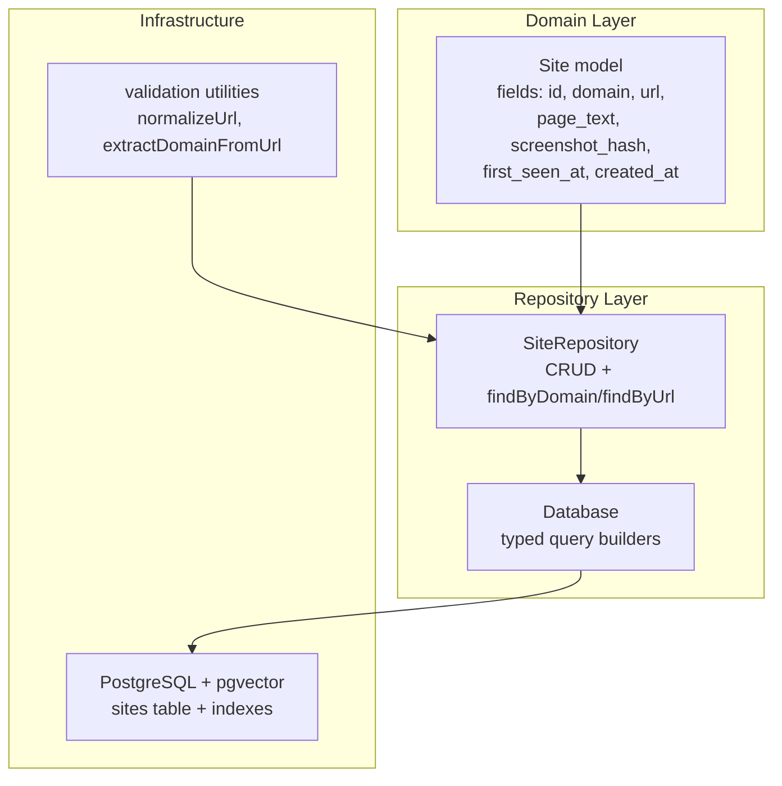
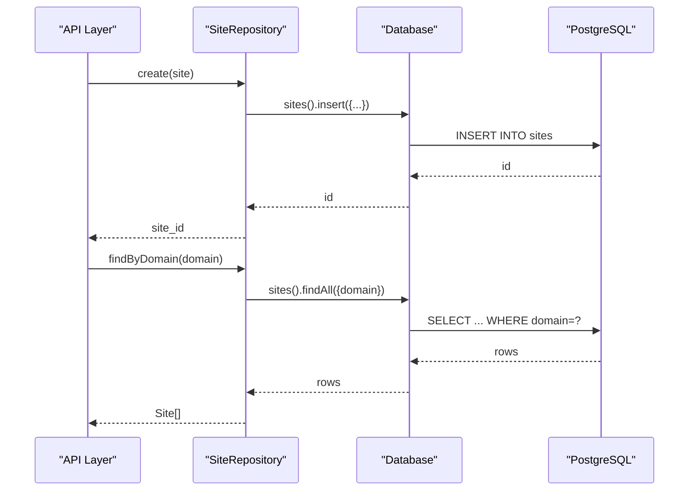
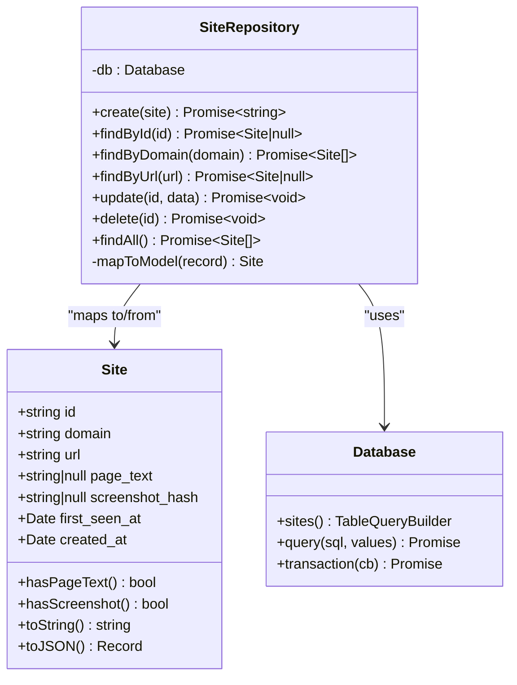

# Site Repository

<cite>
**Referenced Files in This Document**
- [Site.ts](file://src/domain/models/Site.ts)
- [SiteRepository.ts](file://src/repository/SiteRepository.ts)
- [Database.ts](file://src/repository/Database.ts)
- [001_init_schema.sql](file://db/migrations/001_init_schema.sql)
- [002_add_sample_indexes.sql](file://db/migrations/002_add_sample_indexes.sql)
- [validation.ts](file://src/util/validation.ts)
- [patterns.ts](file://src/domain/constants/patterns.ts)
- [EntityExtractor.ts](file://src/service/EntityExtractor.ts)
- [ARCHITECTURE.md](file://ARCHITECTURE.md)
- [ingest-site.ts](file://src/api/routes/ingest-site.ts)
- [error-handler.ts](file://src/api/middleware/error-handler.ts)
</cite>

## Table of Contents
1. [Introduction](#introduction)
2. [Project Structure](#project-structure)
3. [Core Components](#core-components)
4. [Architecture Overview](#architecture-overview)
5. [Detailed Component Analysis](#detailed-component-analysis)
6. [Dependency Analysis](#dependency-analysis)
7. [Performance Considerations](#performance-considerations)
8. [Troubleshooting Guide](#troubleshooting-guide)
9. [Conclusion](#conclusion)
10. [Appendices](#appendices)

## Introduction
This document provides comprehensive documentation for the SiteRepository, focusing on storefront data management and CRUD operations. It explains the Site model structure, search and filtering capabilities, integration with entity extraction, indexing strategies, and recommended query patterns. It also outlines current limitations around batch operations and ingestion workflows, along with practical examples and error handling patterns.

## Project Structure
The SiteRepository resides in the repository layer and interacts with the Database abstraction and the Site domain model. The database schema defines the sites table and supporting indexes. Validation utilities support URL and domain normalization and validation.

**Diagram sources**
- [Site.ts:7-52](file://src/domain/models/Site.ts#L7-L52)
- [SiteRepository.ts:10-95](file://src/repository/SiteRepository.ts#L10-L95)
- [Database.ts:164-174](file://src/repository/Database.ts#L164-L174)
- [001_init_schema.sql:13-21](file://db/migrations/001_init_schema.sql#L13-L21)
- [validation.ts:75-117](file://src/util/validation.ts#L75-L117)

**Section sources**
- [Site.ts:7-52](file://src/domain/models/Site.ts#L7-L52)
- [SiteRepository.ts:10-95](file://src/repository/SiteRepository.ts#L10-L95)
- [Database.ts:164-174](file://src/repository/Database.ts#L164-L174)
- [001_init_schema.sql:13-21](file://db/migrations/001_init_schema.sql#L13-L21)
- [validation.ts:75-117](file://src/util/validation.ts#L75-L117)

## Core Components
- Site model: Immutable domain object encapsulating storefront metadata and timestamps.
- SiteRepository: Typed CRUD access to the sites table with domain and URL lookups.
- Database: Singleton client with typed query builders for each table.
- Database schema: sites table with primary key, required fields, and indexes.
- Validation utilities: URL normalization and domain extraction helpers.

Key responsibilities:
- Create/update/delete sites.
- Lookup by domain and URL.
- Map database rows to Site model instances.

**Section sources**
- [Site.ts:7-52](file://src/domain/models/Site.ts#L7-L52)
- [SiteRepository.ts:10-95](file://src/repository/SiteRepository.ts#L10-L95)
- [Database.ts:164-174](file://src/repository/Database.ts#L164-L174)
- [001_init_schema.sql:13-21](file://db/migrations/001_init_schema.sql#L13-L21)

## Architecture Overview
The SiteRepository participates in the ingestion and resolution flows. It stores site records and integrates with the entity extraction pipeline that produces entities linked to sites.

**Diagram sources**
- [SiteRepository.ts:20-41](file://src/repository/SiteRepository.ts#L20-L41)
- [Database.ts:260-290](file://src/repository/Database.ts#L260-L290)
- [001_init_schema.sql:13-21](file://db/migrations/001_init_schema.sql#L13-L21)

## Detailed Component Analysis

### Site Model
The Site model exposes immutable fields and derived properties:
- Identity: id
- Identification: domain, url
- Content: page_text (nullable)
- Visual: screenshot_hash (nullable)
- Timestamps: first_seen_at, created_at
- Helpers: hasPageText, hasScreenshot, toString, toJSON

Validation and normalization:
- URL normalization and domain extraction are provided by validation utilities.
- Domain validation patterns are defined centrally.

**Section sources**
- [Site.ts:7-52](file://src/domain/models/Site.ts#L7-L52)
- [validation.ts:75-117](file://src/util/validation.ts#L75-L117)
- [patterns.ts:59-64](file://src/domain/constants/patterns.ts#L59-L64)

### SiteRepository
Operations:
- create: inserts a new site with optional first_seen_at, returns id.
- findById: fetches by id.
- findByDomain: returns all sites matching a domain.
- findByUrl: returns the first site matching a URL.
- update: updates arbitrary fields.
- delete: removes a site.
- findAll: returns all sites.

Mapping:
- Private mapToModel converts database records to Site instances.

Search and filtering:
- Domain-based lookup supported via findAll with domain filter.
- URL-based lookup supported via findAll with url filter.
- No native pattern matching (e.g., LIKE) is exposed; URL equality is used.

Temporal filtering:
- No explicit temporal filters are provided in the repository.
- The model includes first_seen_at and created_at for potential future use.

**Section sources**
- [SiteRepository.ts:10-95](file://src/repository/SiteRepository.ts#L10-L95)
- [Database.ts:277-290](file://src/repository/Database.ts#L277-L290)

### Database Abstraction
- Typed query builders per table expose insert/findById/findAll/update/delete.
- findAll supports optional filters; generated SQL uses equality conditions.
- Connection pooling and retry logic for transient database errors.

**Section sources**
- [Database.ts:164-174](file://src/repository/Database.ts#L164-L174)
- [Database.ts:256-306](file://src/repository/Database.ts#L256-L306)

### Database Schema and Indexes
Schema highlights:
- sites table with UUID primary key, domain, url, page_text, screenshot_hash, timestamps.
- Indexes: domain, created_at, first_seen_at.

Additional indexes (migration 2):
- Composite and partial indexes for common filters and performance tuning.

Constraints:
- NOT NULL on domain and url.
- Default timestamps.

**Section sources**
- [001_init_schema.sql:13-21](file://db/migrations/001_init_schema.sql#L13-L21)
- [001_init_schema.sql:23-26](file://db/migrations/001_init_schema.sql#L23-L26)
- [002_add_sample_indexes.sql:9-46](file://db/migrations/002_add_sample_indexes.sql#L9-L46)

### Entity Extraction Integration
- SiteRepository does not directly call extraction; extraction is part of the ingestion pipeline.
- EntityExtractor extracts structured entities from page_text and normalizes values.
- After extraction, entities are persisted and linked to the site via EntityRepository.
- ResolutionEngine orchestrates downstream steps (normalization, embeddings, similarity, clustering).

Note: The ingestion endpoint is currently a placeholder and not implemented.

**Section sources**
- [EntityExtractor.ts:32-80](file://src/service/EntityExtractor.ts#L32-L80)
- [EntityExtractor.ts:97-210](file://src/service/EntityExtractor.ts#L97-L210)
- [ingest-site.ts:8-16](file://src/api/routes/ingest-site.ts#L8-L16)
- [ARCHITECTURE.md:53-95](file://ARCHITECTURE.md#L53-L95)

### Examples

- Site creation
  - Use SiteRepository.create with domain, url, page_text, screenshot_hash, first_seen_at.
  - Returns the new site id.

- Domain lookup
  - Use SiteRepository.findByDomain(domain) to retrieve all sites for a given domain.

- URL validation and normalization
  - Use validation.normalizeUrl(url) to normalize URLs.
  - Use validation.validateUrl(url) to validate URL format.
  - Use validation.extractDomainFromUrl(url) to derive domain.

- Search functionality
  - findByDomain(domain) performs equality lookup on domain.
  - findByUrl(url) performs equality lookup on url.

- Temporal filtering
  - Not currently exposed by SiteRepository; consider adding filters on first_seen_at or created_at in the future.

- Error handling
  - Database operations may throw on transient failures; the Database client retries on specific error codes.
  - API error handling middleware logs and returns structured errors.

**Section sources**
- [SiteRepository.ts:20-49](file://src/repository/SiteRepository.ts#L20-L49)
- [validation.ts:75-117](file://src/util/validation.ts#L75-L117)
- [validation.ts:49-59](file://src/util/validation.ts#L49-L59)
- [Database.ts:94-115](file://src/repository/Database.ts#L94-L115)
- [error-handler.ts:16-37](file://src/api/middleware/error-handler.ts#L16-L37)

### Batch Operations and Ingestion Workflows
- Current state: SiteRepository supports single-record CRUD and lookups.
- Ingestion endpoint is a placeholder and not implemented.
- No dedicated batch insert/update methods are present in SiteRepository.
- Recommended approach: Use Database.transaction to wrap multiple SiteRepository.create calls for atomicity.

**Section sources**
- [SiteRepository.ts:10-95](file://src/repository/SiteRepository.ts#L10-L95)
- [Database.ts:120-137](file://src/repository/Database.ts#L120-L137)
- [ingest-site.ts:8-16](file://src/api/routes/ingest-site.ts#L8-L16)

## Dependency Analysis

**Diagram sources**
- [Site.ts:7-52](file://src/domain/models/Site.ts#L7-L52)
- [SiteRepository.ts:10-95](file://src/repository/SiteRepository.ts#L10-L95)
- [Database.ts:164-174](file://src/repository/Database.ts#L164-L174)

**Section sources**
- [Site.ts:7-52](file://src/domain/models/Site.ts#L7-L52)
- [SiteRepository.ts:10-95](file://src/repository/SiteRepository.ts#L10-L95)
- [Database.ts:164-174](file://src/repository/Database.ts#L164-L174)

## Performance Considerations
- Existing indexes:
  - Domain: idx_sites_domain
  - Timestamps: idx_sites_created_at, idx_sites_first_seen_at
- Recommendations:
  - Consider a unique index on url to prevent duplicates if URL equality is desired for de-duplication.
  - If frequent temporal queries are needed, add indexes on first_seen_at or created_at ranges.
  - For high-cardinality domains, ensure domain normalization (lowercase) is applied consistently.

[No sources needed since this section provides general guidance]

## Troubleshooting Guide
Common issues and patterns:
- Transient database errors: The Database client retries on specific network/availability errors; inspect logs for retry behavior.
- 404/Not Found: Global notFoundHandler returns a standardized 404 response.
- Validation failures: Use validation utilities to normalize and validate inputs before repository calls.
- Ingestion not implemented: The ingest-site route returns a 501; implement ingestion pipeline to populate sites and entities.

**Section sources**
- [Database.ts:94-115](file://src/repository/Database.ts#L94-L115)
- [error-handler.ts:42-47](file://src/api/middleware/error-handler.ts#L42-L47)
- [validation.ts:75-117](file://src/util/validation.ts#L75-L117)
- [ingest-site.ts:8-16](file://src/api/routes/ingest-site.ts#L8-L16)

## Conclusion
The SiteRepository provides a focused, typed interface for managing storefront records with efficient domain and URL lookups. While ingestion and batch operations are not yet implemented, the underlying schema and validation utilities are in place to support robust data management. Extending the repository with temporal filters and batch helpers, combined with proper indexing, will further improve performance and developer ergonomics.

## Appendices

### Data Integrity Constraints and Validation Rules
- Database constraints:
  - domain: NOT NULL
  - url: NOT NULL
  - Default timestamps: first_seen_at, created_at
- Validation utilities:
  - validateUrl, normalizeUrl, extractDomainFromUrl
  - validateDomain

**Section sources**
- [001_init_schema.sql:15-20](file://db/migrations/001_init_schema.sql#L15-L20)
- [validation.ts:49-59](file://src/util/validation.ts#L49-L59)
- [validation.ts:75-117](file://src/util/validation.ts#L75-L117)
- [validation.ts:64-70](file://src/util/validation.ts#L64-L70)

### Query Pattern Recommendations
- Domain-based queries: Use findByDomain(domain) for equality filtering.
- URL-based queries: Use findByUrl(url) for equality filtering.
- Temporal queries: Add new repository methods with filters on first_seen_at or created_at if needed.
- De-duplication: Consider a unique index on url if URL equality is required.

**Section sources**
- [SiteRepository.ts:38-49](file://src/repository/SiteRepository.ts#L38-L49)
- [002_add_sample_indexes.sql:49-63](file://db/migrations/002_add_sample_indexes.sql#L49-L63)