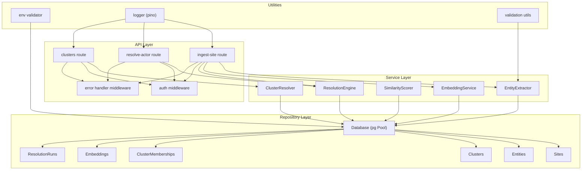
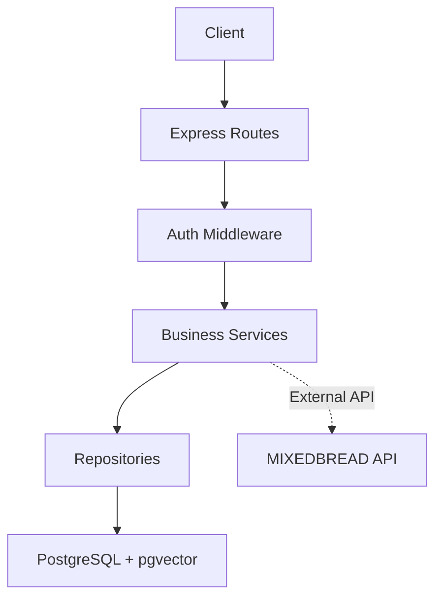
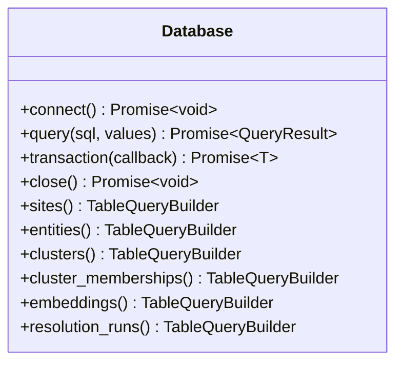
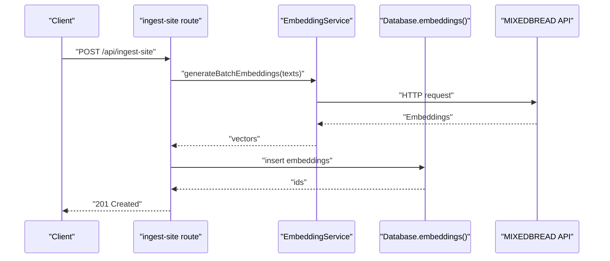
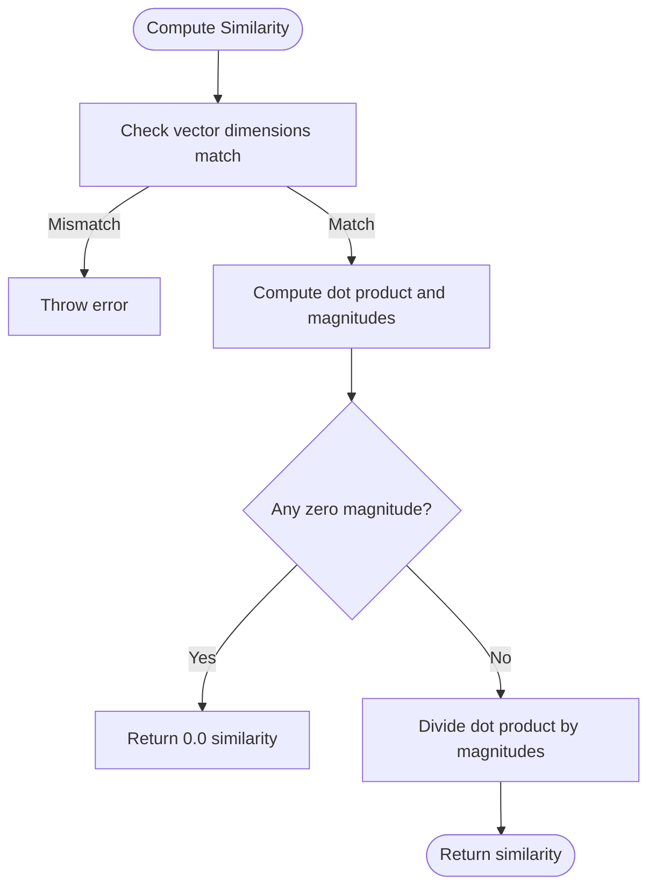
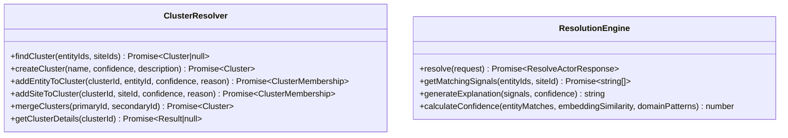
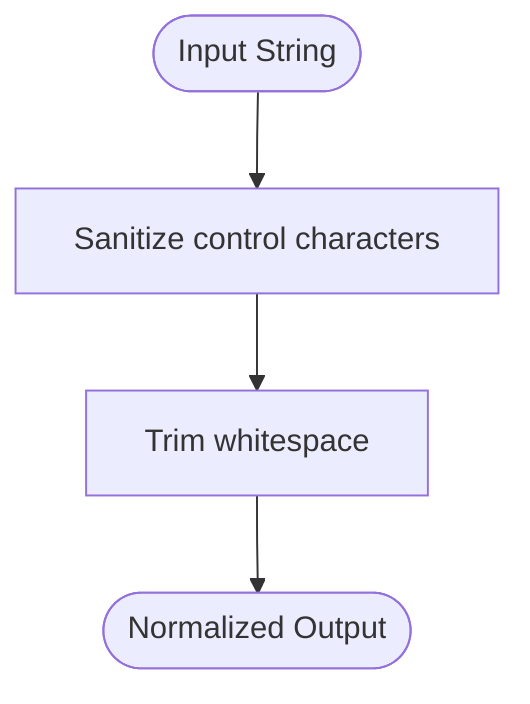
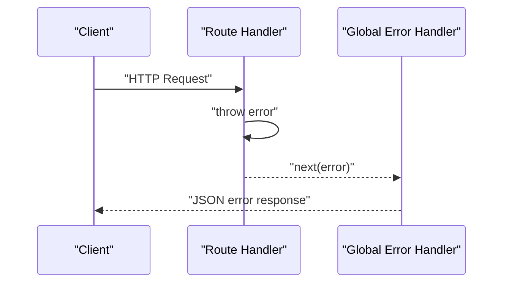
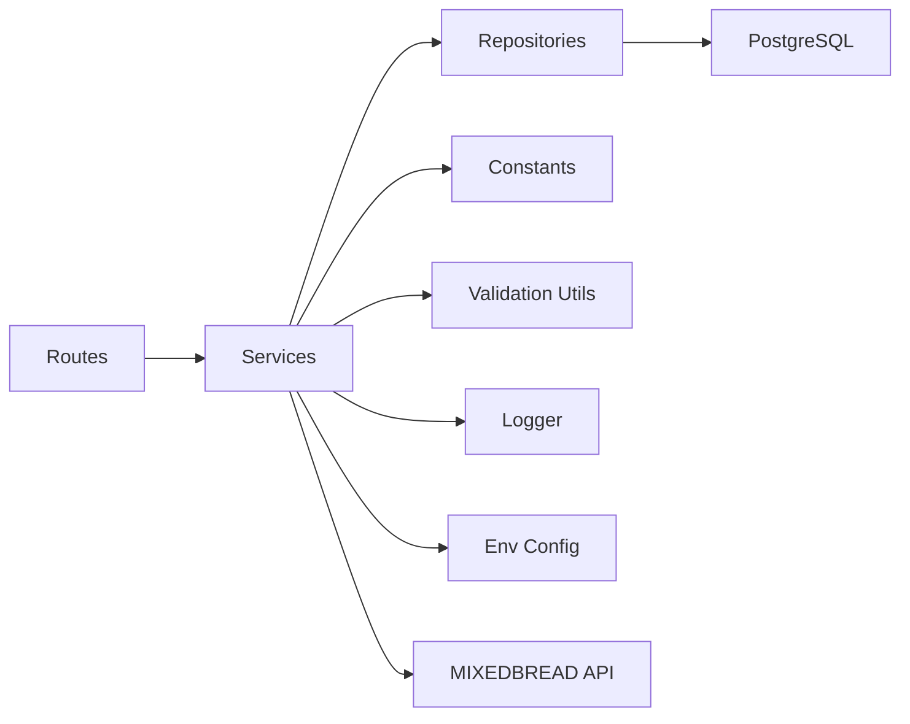

# Troubleshooting & FAQ

<cite>
**Referenced Files in This Document**
- [README.md](file://README.md)
- [ARCHITECTURE.md](file://ARCHITECTURE.md)
- [src/util/env.ts](file://src/util/env.ts)
- [src/util/logger.ts](file://src/util/logger.ts)
- [src/api/middleware/error-handler.ts](file://src/api/middleware/error-handler.ts)
- [src/api/middleware/auth.ts](file://src/api/middleware/auth.ts)
- [src/api/routes/ingest-site.ts](file://src/api/routes/ingest-site.ts)
- [src/api/routes/resolve-actor.ts](file://src/api/routes/resolve-actor.ts)
- [src/api/routes/clusters.ts](file://src/api/routes/clusters.ts)
- [src/repository/Database.ts](file://src/repository/Database.ts)
- [src/service/EmbeddingService.ts](file://src/service/EmbeddingService.ts)
- [src/service/SimilarityScorer.ts](file://src/service/SimilarityScorer.ts)
- [src/service/ClusterResolver.ts](file://src/service/ClusterResolver.ts)
- [src/service/EntityExtractor.ts](file://src/service/EntityExtractor.ts)
- [src/service/ResolutionEngine.ts](file://src/service/ResolutionEngine.ts)
- [src/util/validation.ts](file://src/util/validation.ts)
- [db/migrations/001_init_schema.sql](file://db/migrations/001_init_schema.sql)
- [db/migrations/002_add_sample_indexes.sql](file://db/migrations/002_add_sample_indexes.sql)
- [db/run-migrations.ts](file://db/run-migrations.ts)
- [db/seed.ts](file://db/seed.ts)
- [demos/curl-examples.sh](file://demos/curl-examples.sh)
- [demos/end-to-end.ts](file://demos/end-to-end.ts)
</cite>

## Table of Contents
1. [Introduction](#introduction)
2. [Project Structure](#project-structure)
3. [Core Components](#core-components)
4. [Architecture Overview](#architecture-overview)
5. [Detailed Component Analysis](#detailed-component-analysis)
6. [Dependency Analysis](#dependency-analysis)
7. [Performance Considerations](#performance-considerations)
8. [Troubleshooting Guide](#troubleshooting-guide)
9. [Conclusion](#conclusion)
10. [Appendices](#appendices)

## Introduction
This document provides a comprehensive troubleshooting and FAQ guide for ARES. It focuses on diagnosing and resolving common setup and runtime issues, including database connectivity, API key validation, port conflicts, embedding generation failures, similarity scoring problems, cluster assignment errors, performance bottlenecks, error handling and logging patterns, validation and input sanitization pitfalls, API response troubleshooting, external service integrations (MIXEDBREAD API), and system health verification. It also answers frequently asked questions about system limitations, supported data formats, and customization options.

## Project Structure
ARES follows a layered architecture with clear separation between API, service, repository, and utility layers. The API layer exposes REST endpoints, the service layer implements business logic, the repository layer abstracts database operations, and utilities provide logging, validation, and environment configuration.

**Diagram sources**
- [src/api/routes/ingest-site.ts:1-19](file://src/api/routes/ingest-site.ts#L1-L19)
- [src/api/routes/resolve-actor.ts:1-19](file://src/api/routes/resolve-actor.ts#L1-L19)
- [src/api/routes/clusters.ts:1-19](file://src/api/routes/clusters.ts#L1-L19)
- [src/api/middleware/auth.ts:1-24](file://src/api/middleware/auth.ts#L1-L24)
- [src/api/middleware/error-handler.ts:1-50](file://src/api/middleware/error-handler.ts#L1-L50)
- [src/service/EntityExtractor.ts:1-53](file://src/service/EntityExtractor.ts#L1-L53)
- [src/service/EmbeddingService.ts:1-66](file://src/service/EmbeddingService.ts#L1-L66)
- [src/service/SimilarityScorer.ts:1-64](file://src/service/SimilarityScorer.ts#L1-L64)
- [src/service/ClusterResolver.ts:1-85](file://src/service/ClusterResolver.ts#L1-L85)
- [src/service/ResolutionEngine.ts:1-70](file://src/service/ResolutionEngine.ts#L1-L70)
- [src/repository/Database.ts:1-315](file://src/repository/Database.ts#L1-L315)
- [src/util/env.ts:1-122](file://src/util/env.ts#L1-L122)
- [src/util/logger.ts:1-104](file://src/util/logger.ts#L1-L104)
- [src/util/validation.ts:1-207](file://src/util/validation.ts#L1-L207)

**Section sources**
- [README.md:107-137](file://README.md#L107-L137)
- [ARCHITECTURE.md:1-251](file://ARCHITECTURE.md#L1-L251)

## Core Components
- Environment configuration and validation: Ensures required variables are present and valid, exits early in production if invalid.
- Structured logging: Centralized logger with redaction and request-scoped contexts.
- Global error handling: Standardized HTTP error responses and request error logging.
- Database abstraction: Singleton Postgres client with connection pooling, retry logic for transient errors, transactions, and typed query builders.
- Validation utilities: Input validation and sanitization helpers for URLs, domains, emails, phones, handles, UUIDs, and strings.
- Services:
  - EntityExtractor: Placeholder for extracting entities from page text.
  - EmbeddingService: Placeholder for generating embeddings via MIXEDBREAD API.
  - SimilarityScorer: Placeholder for cosine similarity computation and top-K selection.
  - ClusterResolver: Placeholder for cluster lookup, creation, membership, merging, and details retrieval.
  - ResolutionEngine: Orchestrates resolution pipeline and generates explanations.

**Section sources**
- [src/util/env.ts:1-122](file://src/util/env.ts#L1-L122)
- [src/util/logger.ts:1-104](file://src/util/logger.ts#L1-L104)
- [src/api/middleware/error-handler.ts:1-50](file://src/api/middleware/error-handler.ts#L1-L50)
- [src/repository/Database.ts:1-315](file://src/repository/Database.ts#L1-L315)
- [src/util/validation.ts:1-207](file://src/util/validation.ts#L1-L207)
- [src/service/EntityExtractor.ts:1-53](file://src/service/EntityExtractor.ts#L1-L53)
- [src/service/EmbeddingService.ts:1-66](file://src/service/EmbeddingService.ts#L1-L66)
- [src/service/SimilarityScorer.ts:1-64](file://src/service/SimilarityScorer.ts#L1-L64)
- [src/service/ClusterResolver.ts:1-85](file://src/service/ClusterResolver.ts#L1-L85)
- [src/service/ResolutionEngine.ts:1-70](file://src/service/ResolutionEngine.ts#L1-L70)

## Architecture Overview
ARES is designed as a modular, layered service. The API layer validates requests and delegates to services. Services orchestrate business logic and persist data via repositories. The repository layer encapsulates database operations with connection pooling and retry logic. External dependencies include PostgreSQL with pgvector and MIXEDBREAD for embeddings.

**Diagram sources**
- [ARCHITECTURE.md:1-251](file://ARCHITECTURE.md#L1-L251)
- [src/api/middleware/auth.ts:1-24](file://src/api/middleware/auth.ts#L1-L24)
- [src/service/EmbeddingService.ts:1-66](file://src/service/EmbeddingService.ts#L1-L66)
- [src/repository/Database.ts:1-315](file://src/repository/Database.ts#L1-L315)

## Detailed Component Analysis

### Database Connectivity and Transactions
- Connection pooling and retry: The database client initializes a pool with configurable limits and retries on transient PostgreSQL errors.
- Transactions: All repository operations support ACID transactions with automatic rollback on errors.
- Typed query builders: Insert, find, update, delete operations are generated per table with compile-time safety.

**Diagram sources**
- [src/repository/Database.ts:1-315](file://src/repository/Database.ts#L1-L315)

**Section sources**
- [src/repository/Database.ts:56-148](file://src/repository/Database.ts#L56-L148)
- [src/repository/Database.ts:119-137](file://src/repository/Database.ts#L119-L137)
- [src/repository/Database.ts:256-306](file://src/repository/Database.ts#L256-L306)

### Embedding Generation Pipeline
- External API dependency: EmbeddingService currently returns placeholder vectors and is intended to call MIXEDBREAD API.
- Batch processing: Supports generating embeddings for multiple texts.
- Vector storage: Embeddings are persisted with source metadata for similarity search.

**Diagram sources**
- [src/api/routes/ingest-site.ts:1-19](file://src/api/routes/ingest-site.ts#L1-L19)
- [src/service/EmbeddingService.ts:1-66](file://src/service/EmbeddingService.ts#L1-L66)
- [src/repository/Database.ts:224-233](file://src/repository/Database.ts#L224-L233)

**Section sources**
- [src/service/EmbeddingService.ts:1-66](file://src/service/EmbeddingService.ts#L1-L66)
- [ARCHITECTURE.md:230-241](file://ARCHITECTURE.md#L230-L241)

### Similarity Scoring and Thresholds
- Cosine similarity: Implemented with dimension checks and zero-magnitude handling.
- Top-K selection: Sorts candidates by similarity and returns the highest-scoring items.
- Thresholds: Defined constants for similarity and confidence levels.

**Diagram sources**
- [src/service/SimilarityScorer.ts:1-64](file://src/service/SimilarityScorer.ts#L1-L64)
- [src/domain/constants/thresholds.ts:1-59](file://src/domain/constants/thresholds.ts#L1-L59)

**Section sources**
- [src/service/SimilarityScorer.ts:1-64](file://src/service/SimilarityScorer.ts#L1-L64)
- [src/domain/constants/thresholds.ts:1-59](file://src/domain/constants/thresholds.ts#L1-L59)

### Cluster Assignment and Resolution Engine
- ClusterResolver: Placeholder for finding, creating, merging, and retrieving cluster details.
- ResolutionEngine: Orchestrates entity extraction, normalization, embeddings, similarity scoring, and cluster assignment.

**Diagram sources**
- [src/service/ClusterResolver.ts:1-85](file://src/service/ClusterResolver.ts#L1-L85)
- [src/service/ResolutionEngine.ts:1-70](file://src/service/ResolutionEngine.ts#L1-L70)

**Section sources**
- [src/service/ClusterResolver.ts:1-85](file://src/service/ClusterResolver.ts#L1-L85)
- [src/service/ResolutionEngine.ts:1-70](file://src/service/ResolutionEngine.ts#L1-L70)

### Input Validation and Sanitization
- URL, domain, email, phone, handle, UUID validation and normalization.
- String sanitization removes control characters while preserving meaningful content.

**Diagram sources**
- [src/util/validation.ts:184-191](file://src/util/validation.ts#L184-L191)

**Section sources**
- [src/util/validation.ts:1-207](file://src/util/validation.ts#L1-L207)

### API Routes and Error Handling
- Routes currently return “Not implemented” placeholders.
- Global error handler logs request errors and returns standardized JSON responses.
- Authentication middleware is a placeholder and does not enforce security yet.

**Diagram sources**
- [src/api/routes/ingest-site.ts:1-19](file://src/api/routes/ingest-site.ts#L1-L19)
- [src/api/middleware/error-handler.ts:1-50](file://src/api/middleware/error-handler.ts#L1-L50)

**Section sources**
- [src/api/routes/ingest-site.ts:1-19](file://src/api/routes/ingest-site.ts#L1-L19)
- [src/api/routes/resolve-actor.ts:1-19](file://src/api/routes/resolve-actor.ts#L1-L19)
- [src/api/routes/clusters.ts:1-19](file://src/api/routes/clusters.ts#L1-L19)
- [src/api/middleware/error-handler.ts:1-50](file://src/api/middleware/error-handler.ts#L1-L50)
- [src/api/middleware/auth.ts:1-24](file://src/api/middleware/auth.ts#L1-L24)

## Dependency Analysis
- Internal dependencies:
  - Routes depend on services and middleware.
  - Services depend on repositories and constants.
  - Repositories depend on the Database singleton and Postgres.
- External dependencies:
  - PostgreSQL with pgvector for data and vector similarity.
  - MIXEDBREAD API for embeddings.
- Environment and logging:
  - Environment validation enforces required variables.
  - Logger centralizes structured logs with redaction.

**Diagram sources**
- [src/api/routes/ingest-site.ts:1-19](file://src/api/routes/ingest-site.ts#L1-L19)
- [src/service/EmbeddingService.ts:1-66](file://src/service/EmbeddingService.ts#L1-L66)
- [src/repository/Database.ts:1-315](file://src/repository/Database.ts#L1-L315)
- [src/util/env.ts:1-122](file://src/util/env.ts#L1-L122)
- [src/util/logger.ts:1-104](file://src/util/logger.ts#L1-L104)
- [src/util/validation.ts:1-207](file://src/util/validation.ts#L1-L207)

**Section sources**
- [ARCHITECTURE.md:230-241](file://ARCHITECTURE.md#L230-L241)
- [src/util/env.ts:1-122](file://src/util/env.ts#L1-L122)
- [src/util/logger.ts:1-104](file://src/util/logger.ts#L1-L104)

## Performance Considerations
- Slow queries:
  - Use database indexes for domain lookups, normalized entity values, and cluster membership joins.
  - Monitor vector similarity queries; ensure pgvector IVFFlat index is configured.
- Memory usage:
  - Batch embedding generation to reduce peak memory.
  - Limit top-K similarity results to reduce intermediate arrays.
- Database tuning:
  - Connection pool size and timeouts are configurable in the Database client.
  - Retry transient errors automatically to improve resilience under load.

**Section sources**
- [ARCHITECTURE.md:198-204](file://ARCHITECTURE.md#L198-L204)
- [db/migrations/002_add_sample_indexes.sql](file://db/migrations/002_add_sample_indexes.sql)
- [src/repository/Database.ts:61-66](file://src/repository/Database.ts#L61-L66)
- [src/repository/Database.ts:94-115](file://src/repository/Database.ts#L94-L115)

## Troubleshooting Guide

### Setup Problems

- Database connection failures
  - Symptoms: Startup errors indicating inability to connect; transaction failures; “Database not connected” errors.
  - Causes: Incorrect DATABASE_URL, missing pgvector extension, network issues, or PostgreSQL down.
  - Steps:
    1. Verify DATABASE_URL correctness and accessibility.
    2. Confirm PostgreSQL 14+ with pgvector installed and enabled.
    3. Run migrations to initialize schema and indexes.
    4. Test connectivity using the Database client’s connection routine.
  - Related code paths:
    - [src/util/env.ts:17-79](file://src/util/env.ts#L17-L79)
    - [src/repository/Database.ts:56-71](file://src/repository/Database.ts#L56-L71)
    - [db/run-migrations.ts](file://db/run-migrations.ts)
    - [db/migrations/001_init_schema.sql](file://db/migrations/001_init_schema.sql)
    - [db/migrations/002_add_sample_indexes.sql](file://db/migrations/002_add_sample_indexes.sql)

- API key validation errors
  - Symptoms: Embedding generation failures or unauthorized responses.
  - Causes: Missing or invalid MIXEDBREAD_API_KEY.
  - Steps:
    1. Set MIXEDBREAD_API_KEY in environment.
    2. Confirm API key validity and quota.
    3. Review EmbeddingService integration when implemented.
  - Related code paths:
    - [README.md:193-203](file://README.md#L193-L203)
    - [src/util/env.ts:72-78](file://src/util/env.ts#L72-L78)
    - [src/service/EmbeddingService.ts:1-66](file://src/service/EmbeddingService.ts#L1-L66)

- Port conflicts
  - Symptoms: Server fails to start on the configured port.
  - Causes: Another process occupies PORT.
  - Steps:
    1. Change PORT in environment variables.
    2. Ensure firewall allows the port.
    3. Verify startup logs show the bound address.
  - Related code paths:
    - [src/util/env.ts:50-54](file://src/util/env.ts#L50-L54)
    - [README.md:46](file://README.md#L46)

- Health check endpoint
  - Use the documented health endpoint to verify service availability.
  - Related code paths:
    - [README.md:52-58](file://README.md#L52-L58)

### Runtime Issues

- Embedding generation failures
  - Symptoms: Empty or placeholder vectors; API errors; timeouts.
  - Steps:
    1. Validate MIXEDBREAD_API_KEY and network access.
    2. Implement EmbeddingService API calls and add retries with exponential backoff.
    3. Persist embeddings and log errors with structured logging.
  - Related code paths:
    - [src/service/EmbeddingService.ts:1-66](file://src/service/EmbeddingService.ts#L1-L66)
    - [src/util/logger.ts:78-101](file://src/util/logger.ts#L78-L101)

- Similarity scoring problems
  - Symptoms: Unexpected zero similarity, mismatched dimensions, or incorrect top-K results.
  - Steps:
    1. Ensure vectors have equal dimensions.
    2. Check for zero-magnitude vectors.
    3. Adjust thresholds and top-K values as needed.
  - Related code paths:
    - [src/service/SimilarityScorer.ts:12-35](file://src/service/SimilarityScorer.ts#L12-L35)
    - [src/domain/constants/thresholds.ts:7-16](file://src/domain/constants/thresholds.ts#L7-L16)

- Cluster assignment errors
  - Symptoms: Null cluster assignments, “Not implemented” errors, or inconsistent memberships.
  - Steps:
    1. Implement ClusterResolver methods.
    2. Validate entity/site IDs and normalized values.
    3. Use transactions for atomic updates.
  - Related code paths:
    - [src/service/ClusterResolver.ts:1-85](file://src/service/ClusterResolver.ts#L1-L85)
    - [src/repository/Database.ts:119-137](file://src/repository/Database.ts#L119-L137)

- Resolution pipeline stalls
  - Symptoms: Endpoint returns “Not implemented.”
  - Steps:
    1. Implement ResolutionEngine.resolve and supporting methods.
    2. Wire routes to call the engine.
  - Related code paths:
    - [src/service/ResolutionEngine.ts:1-70](file://src/service/ResolutionEngine.ts#L1-L70)
    - [src/api/routes/ingest-site.ts:1-19](file://src/api/routes/ingest-site.ts#L1-L19)
    - [src/api/routes/resolve-actor.ts:1-19](file://src/api/routes/resolve-actor.ts#L1-L19)

### Error Handling Patterns, Logging, and Debugging

- Error handling
  - Global error handler standardizes responses and logs request context.
  - 404 handler reports missing endpoints.
  - Related code paths:
    - [src/api/middleware/error-handler.ts:16-47](file://src/api/middleware/error-handler.ts#L16-L47)

- Logging strategies
  - Structured logs with timestamps, service context, and redaction of sensitive fields.
  - Operation timing wrapper logs start, completion, and failures with durations.
  - Request-scoped loggers include requestId and path.
  - Related code paths:
    - [src/util/logger.ts:15-51](file://src/util/logger.ts#L15-L51)
    - [src/util/logger.ts:68-73](file://src/util/logger.ts#L68-L73)
    - [src/util/logger.ts:78-101](file://src/util/logger.ts#L78-L101)

- Debugging techniques
  - Enable development mode for pretty-printed logs.
  - Use structured logs to correlate errors with request IDs and paths.
  - Add granular operation logs around embedding generation and similarity computations.
  - Related code paths:
    - [src/util/env.ts:89-98](file://src/util/env.ts#L89-L98)
    - [src/util/logger.ts:15-51](file://src/util/logger.ts#L15-L51)

### Validation, Input Sanitization, and API Responses

- Validation error scenarios
  - Invalid URLs, domains, emails, phones, or UUIDs cause downstream processing issues.
  - Steps:
    1. Validate inputs before processing.
    2. Normalize values consistently.
    3. Sanitize strings to remove control characters.
  - Related code paths:
    - [src/util/validation.ts:15-70](file://src/util/validation.ts#L15-L70)
    - [src/util/validation.ts:184-191](file://src/util/validation.ts#L184-L191)

- Input sanitization issues
  - Unsanitized control characters can break parsing or storage.
  - Steps:
    1. Apply sanitizeString before persistence.
    2. Normalize emails, phones, and handles.
  - Related code paths:
    - [src/util/validation.ts:184-191](file://src/util/validation.ts#L184-L191)
    - [src/util/validation.ts:122-169](file://src/util/validation.ts#L122-L169)

- API response troubleshooting
  - Routes currently return “Not implemented.” Ensure routes call services and handle errors via the global error handler.
  - Steps:
    1. Implement route handlers.
    2. Validate request bodies and respond with structured errors.
  - Related code paths:
    - [src/api/routes/ingest-site.ts:9-16](file://src/api/routes/ingest-site.ts#L9-L16)
    - [src/api/middleware/error-handler.ts:16-47](file://src/api/middleware/error-handler.ts#L16-L47)

### External Integrations

- MIXEDBREAD API integration
  - Symptoms: 401/403 errors, rate limiting, or empty embeddings.
  - Steps:
    1. Confirm API key and network access.
    2. Implement EmbeddingService API calls with retries.
    3. Log request/response payloads for diagnostics.
  - Related code paths:
    - [src/service/EmbeddingService.ts:1-66](file://src/service/EmbeddingService.ts#L1-L66)
    - [ARCHITECTURE.md:232-236](file://ARCHITECTURE.md#L232-L236)

- Database connectivity issues
  - Symptoms: Connection timeouts, pool exhaustion, or transient disconnects.
  - Steps:
    1. Increase pool size if needed.
    2. Use retry logic for transient errors.
    3. Monitor connection and idle timeouts.
  - Related code paths:
    - [src/repository/Database.ts:61-66](file://src/repository/Database.ts#L61-L66)
    - [src/repository/Database.ts:94-115](file://src/repository/Database.ts#L94-L115)

### Diagnostic Commands and System Health

- Health verification
  - Use the documented health endpoint to confirm service readiness.
  - Related code paths:
    - [README.md:52-58](file://README.md#L52-L58)

- Database operations
  - Run migrations and seed data to initialize schema and sample records.
  - Related code paths:
    - [db/run-migrations.ts](file://db/run-migrations.ts)
    - [db/seed.ts](file://db/seed.ts)

- End-to-end examples
  - Use demo scripts to validate ingestion and resolution flows.
  - Related code paths:
    - [demos/curl-examples.sh](file://demos/curl-examples.sh)
    - [demos/end-to-end.ts](file://demos/end-to-end.ts)

### Security and Permissions

- Authentication and API keys
  - Authentication middleware is a placeholder; implement API key validation and enforce access controls.
  - Related code paths:
    - [src/api/middleware/auth.ts:1-24](file://src/api/middleware/auth.ts#L1-L24)

- Environment configuration
  - Ensure secrets are not logged; rely on redacted logs.
  - Related code paths:
    - [src/util/env.ts:108-119](file://src/util/env.ts#L108-L119)
    - [src/util/logger.ts:28-31](file://src/util/logger.ts#L28-L31)

### Frequently Asked Questions

- What data formats are supported?
  - Supported validations include URLs, domains, emails, phones, handles, and UUIDs. Normalize and sanitize inputs accordingly.
  - Related code paths:
    - [src/util/validation.ts:1-207](file://src/util/validation.ts#L1-L207)

- Are there system limitations?
  - Embedding dimensionality and similarity thresholds are defined; adjust top-K and thresholds per workload.
  - Related code paths:
    - [src/service/EmbeddingService.ts:1-66](file://src/service/EmbeddingService.ts#L1-L66)
    - [src/domain/constants/thresholds.ts:1-59](file://src/domain/constants/thresholds.ts#L1-L59)

- How do I customize thresholds and weights?
  - Modify constants for similarity and confidence thresholds and entity/embedding weights.
  - Related code paths:
    - [src/domain/constants/thresholds.ts:1-59](file://src/domain/constants/thresholds.ts#L1-L59)

- How do I enable development logging?
  - Set NODE_ENV=development to enable pretty-printed logs and request-scoped contexts.
  - Related code paths:
    - [src/util/env.ts:89-98](file://src/util/env.ts#L89-L98)
    - [src/util/logger.ts:15-51](file://src/util/logger.ts#L15-L51)

## Conclusion
This guide consolidates troubleshooting procedures and FAQs for ARES across setup, runtime, performance, error handling, validation, external integrations, and operational health. As services and routes are implemented, integrate logging, validation, and error handling patterns outlined here to maintain reliability and observability.

## Appendices

### Environment Variables Reference
- DATABASE_URL: Required for PostgreSQL connection.
- MIXEDBREAD_API_KEY: Required for embeddings.
- NODE_ENV: Environment mode (development/production/test).
- PORT: Server port (default 3000).
- LOG_LEVEL: Logging verbosity.
- CORS_ORIGIN: Allowed origins for cross-origin requests.

**Section sources**
- [README.md:193-203](file://README.md#L193-L203)
- [src/util/env.ts:17-79](file://src/util/env.ts#L17-L79)